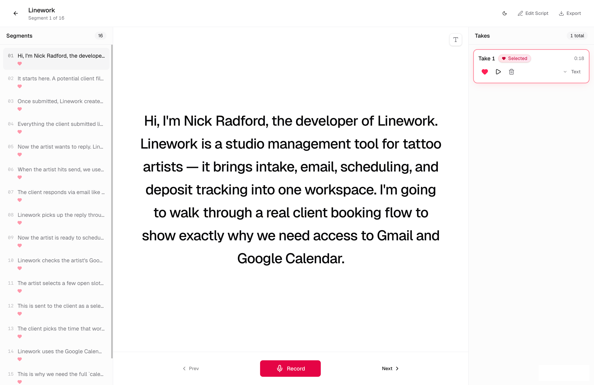
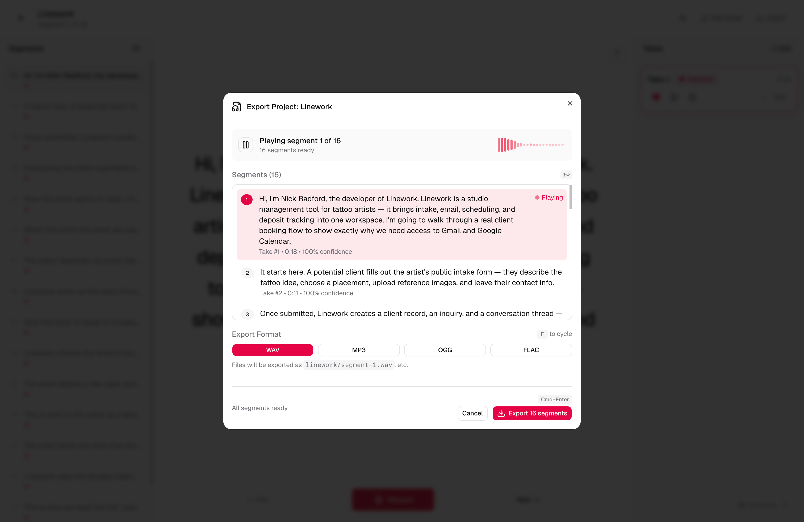

# Savoix

A script recording and transcription application designed for precise dialogue review. Record audio takes, transcribe them automatically, and compare the spoken content against the original script to identify discrepancies.

## Features

- **Script Segmentation**: Automatically breaks scripts into line-by-line segments for organized recording
- **Multiple Takes**: Record and manage multiple takes per segment
- **Automated Transcription**: Integrates with Parakeet for speech-to-text conversion
- **Synchronized Playback**: Audio playback with synchronized transcript rendering
- **Discrepancy Detection**: Highlights omissions, insertions, and contraction mismatches
- **Stable Take Management**: Maintains consistent take numbering across segments, with soft-delete support

## Screenshots

### Project Workspace

The main workspace for reviewing segments, recording takes, and validating transcriptions against the original script.



### Export Modal

The export flow for reviewing ready segments and choosing the output audio format before generating files.



## Technology Stack

- **Frontend**: React 18, React Router, TypeScript, Vite
- **Backend**: Express transport with Effect-powered runtime, services, and request validation
- **Database**: SQLite with Drizzle ORM
- **Styling**: Tailwind CSS, Radix UI
- **Testing**: Vitest

## Installation

### Prerequisites

- [Node.js](https://nodejs.org/) (with pnpm)
- [FFMPEG](https://ffmpeg.org/) - Required for audio export functionality
- [Parakeet](https://github.com/yashhere/parakeet-mlx-fastapi) transcription server

### Setup

1. Install dependencies:

```bash
pnpm install
```

2. Configure environment variables:

```bash
cp .env.example .env
```

The backend reads these settings through Effect config:

- `PING_MESSAGE`: response payload for `GET /api/ping`
- `PARAKEET_ENDPOINT`: base URL for the transcription service
- `DB_PATH`: SQLite database path, defaults to `data/app.db`
- `RECORDINGS_DIR`: local recordings directory, defaults to `recordings/`
- `FFMPEG_BINARY`: ffmpeg executable name or path, defaults to `ffmpeg`

3. Start the Parakeet transcription server:

```bash
uv tool install git+https://github.com/yashhere/parakeet-mlx-fastapi.git
parakeet-server --model mlx-community/parakeet-tdt-0.6b-v3 --port 8765
```

The application expects Parakeet at `http://localhost:8765` by default. To use a different endpoint, set `PARAKEET_ENDPOINT` in your `.env` file.

4. Start the development server:

```bash
pnpm dev
```

The application will be available at [http://localhost:8080](http://localhost:8080).

## Available Scripts

| Command           | Description                                 |
| ----------------- | ------------------------------------------- |
| `pnpm dev`        | Start development server                    |
| `pnpm build`      | Build for production                        |
| `pnpm start`      | Start production server                     |
| `pnpm typecheck`  | Run TypeScript type checking                |
| `pnpm test`       | Run test suite                              |
| `pnpm ci:check`   | Run the same typecheck and test steps as CI |

## Backend Architecture

The backend still mounts into the existing Express/Vite integration, but request handling is now organized around a shared Effect runtime.

- **Transport**: Express remains the HTTP boundary for development, production, and Netlify entrypoints
- **Runtime**: a single Effect runtime wires configuration, Node platform services, repositories, and domain services
- **Validation**: request params and bodies are decoded with `effect/Schema`
- **Errors**: non-2xx responses use a normalized API shape:

```ts
{
  error: {
    code: string;
    message: string;
    details?: unknown;
  };
}
```

- **Services**:
  - `ProjectRepo`, `SegmentRepo`, `TakeRepo` wrap Drizzle access
  - `RecordingStore` manages local `.wav` files
  - `TranscriptionClient` encapsulates Parakeet requests
  - `ExportService` handles ffmpeg checks, conversion, and ZIP export

The main runtime and service wiring lives under `server/effect/`. Route modules in `server/routes/` are intentionally thin and delegate to Effect programs.

## Data Storage

- **Recordings**: Audio files are stored locally in the `recordings/` directory
- **Database**: Application data is persisted in `data/app.db`
- **Take Deletion**: Uses soft-delete mechanism to preserve take numbering and history

## Testing

`pnpm test` now covers both frontend utilities and the backend Effect migration:

- handler-level route tests for project CRUD, segment updates, take flows, recording fetches, and export endpoints
- service-level tests with doubles for transcription and ffmpeg-dependent export logic

The backend tests run against isolated temporary databases and recordings directories so they do not mutate your working data.

## CI

GitHub Actions runs the verification suite on every push and pull request via [.github/workflows/ci.yml](/Users/n/code/script-recorder-validator-d7e/.github/workflows/ci.yml).

For a local pre-push check, run:

```bash
pnpm ci:check
```

To execute the GitHub Actions workflow locally, run:

```bash
npx @redwoodjs/agent-ci run --workflow .github/workflows/ci.yml
```
